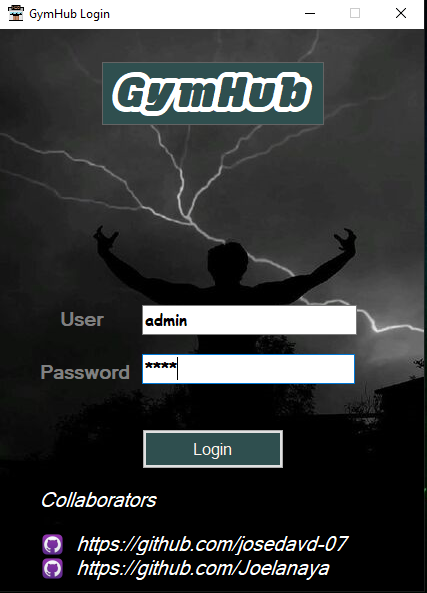
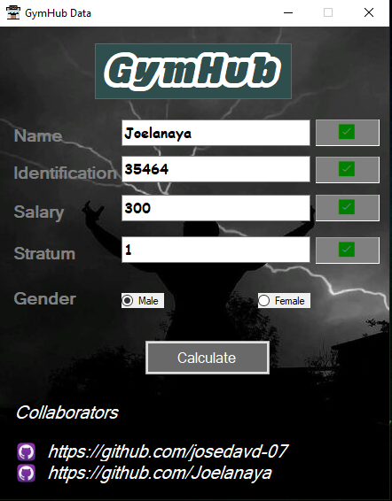
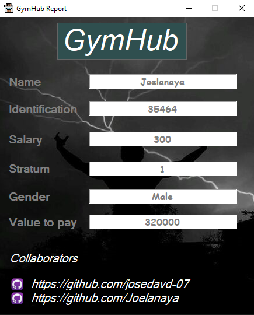

### GymHub Version 1.0.0.1

- 👤 The project user is: admin 

- 🔑 The project password is: 1234

This project is a simple desktop application developed in **C#** using **.NET Framework** and **Windows Forms**,  
where demonstrate our skills in graphical interface design and logic development in Windows.

## ✨ Technologies Used

- 💻 **C#**
- 🧩 **.NET Framework**
- 🪟 **Windows Forms** – Graphical Interface

---

## 📸 Screenshots

| 🖼️ Login Screen | 🖼️ User Registration | 🖼️ Main Interface |
|------------------|------------------------|---------------------|
|  |  |  |

- **Login:** Clean and functional authentication screen.  
- **User Registration:** Clear and validated form for new user creation.  
- **Main Interface:** Main view after login, where the application's features can be accessed.

---

## 📦 Download Installer

You can download the installer version of the GymHub from the following link:

🔗 [Download Installer ](https://www.mediafire.com/file/by2m993l3l27606/GymHub_installer.zip/file)

---

### 🚀 How to Run this Project?

1. Open the `.sln` file with **Visual Studio** (2019 or later recommended).
2. Build the project (`Ctrl + Shift + B`).
3. Run the application (`F5` or "Start" button).
4. Make sure .NET Framework is installed (depending on the version used).

> 💡 *Ensure that .NET Framework is installed to run the application properly.*

---

### 🧠 Motivation

This project was developed to demonstrate our skills in graphical interface design and logic development in Windows Forms with C#, with a focus on functionality, clean design, and clear logic.

---

### 🙌 Colaborators

- 👨‍💻 Jose David Carranza Angarita |🎮 Game Programmer & Software Developer | 📧 ing.josedavidcarranzaangarita@gmail.com | https://github.com/josedavd-07
- 👨‍💻 Joel Anaya Galván | 📱 Android App Developer & Software Developer | https://github.com/Joelanaya
---

### 📜 License

This project is under the MIT License – free to use and modify!
