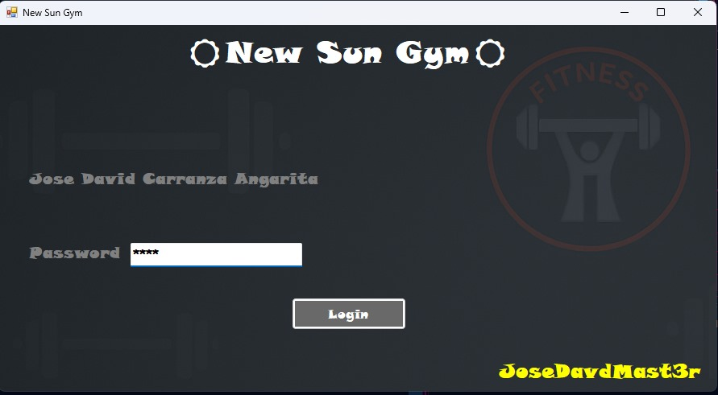
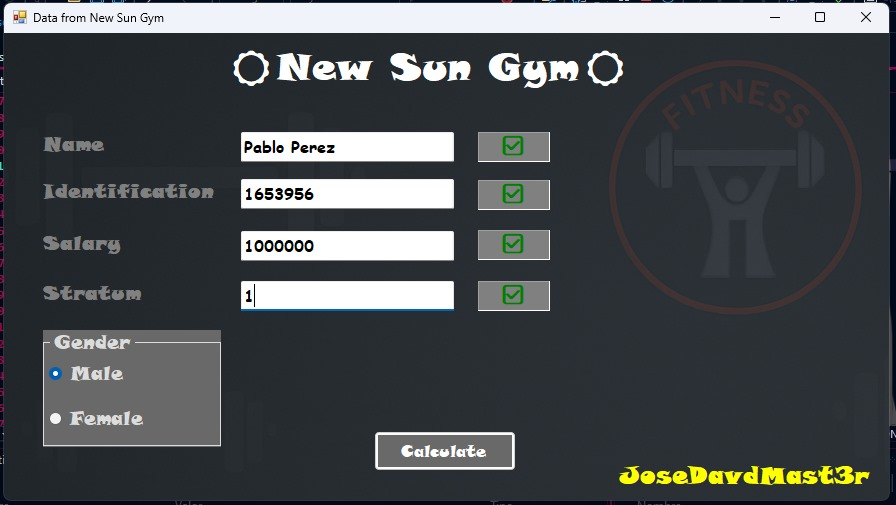
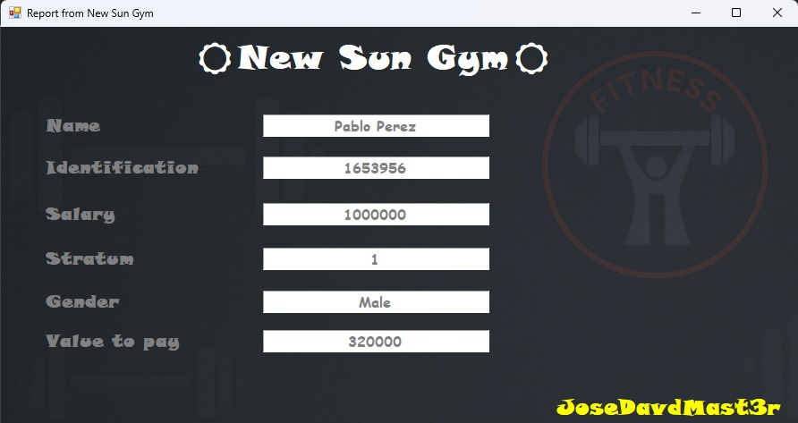

### ☀️New Sun Gym☀️

🔑 The project password is: 1234

This project is a simple desktop application developed in **C#** using **.NET Framework** and **Windows Forms**,  
where I demonstrate my skills in graphical interface design and logic development on Windows.

## ✨ Technologies Used

- 💻 **C#**
- 🧩 **.NET Framework**
- 🪟 **Windows Forms** – Graphical Interface

---

## 📸 Screenshots

| 🖼️ Login Screen | 🖼️ User Registration | 🖼️ Main Interface |
|------------------|------------------------|---------------------|
|  |  |  |

- **Login:** Clean and functional authentication screen.  
- **User Registration:** Clear and validated form for new user creation.  
- **Main Interface:** Main view after login, where the application's features can be accessed.

---

## 📦 Download Executable

You can download the compiled version of the application (.exe) from the following link:

🔗 [Download App .EXE](https://drive.google.com/uc?export=download&id=1TiJoppI5LKR5ufQsvCdFJsSR6yS6GwLR)

---

### 🚀 How to Run this Project?

1. Open the `.sln` file with **Visual Studio** (2019 or later recommended).
2. Build the project (`Ctrl + Shift + B`).
3. Run the application (`F5` or "Start" button).
4. Make sure .NET Framework is installed (depending on the version used).

> 💡 *Ensure that .NET Framework is installed to run the application properly.*

---

### 🧠 Motivation

This project was developed to demonstrate my skills in desktop software development using C# and Windows Forms, with a focus on functionality, clean design, and clear logic.

---

### 🙌 Author

- 👨‍💻 Jose David Carranza Angarita  
- 🎮 Game Programmer & Software Developer  
- 📧 ing.josedavidcarranzaangarita@gmail.com  
- 🌐 [Portfolio](https://jose-david-carranza-unity-developer.netlify.app/)

---

### 📜 License

This project is under the MIT License – free to use and modify!
